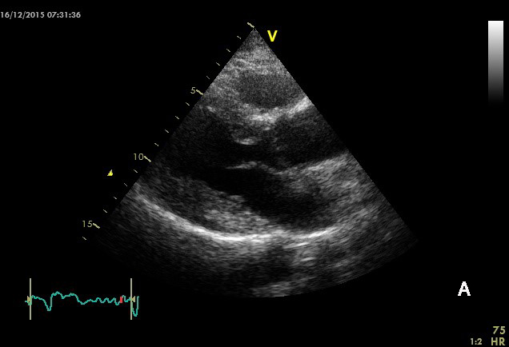
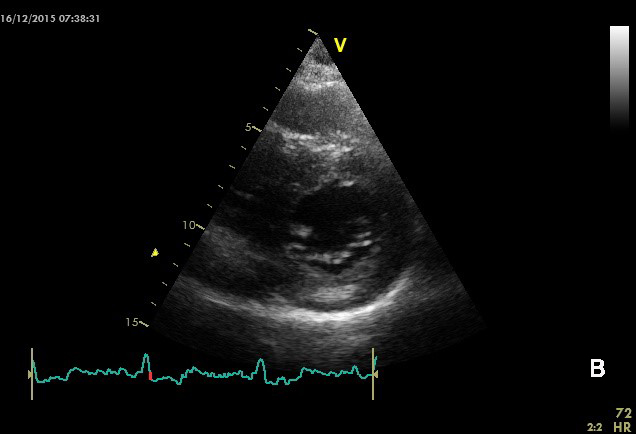

# Echo View Classifier

A deep neural network based approach to classify medical echocardiography images into 8 standard views.

## Introduction

Echocardiography images (echo) are ultrasound scans of the heart. There is a set of 8 standard echo views, namely: PLAX, PSAX-AV, PSAX-MV, PSAX-AP, A2C, A3C, A4C, A5C. Each view shows a different perspective of the heart, and are thus used for different diagnosis of heart diseases. To assist doctors or junior cardiologists, an automatic computer vision based classifier proves helpful in identifying the views with high accuracy (93.9% on a set of 10,000 images).

The neural network is built using TensorFlow Keras library, with a VGG16 convolutional network plus a custom fully-connected network. The output is passed through a softmax layer to predict 1 out of 8 views.

## Dependencies

This Python file is tested on
- Python 3.6
- NumPy 1.15
- Pandas 0.23
- TensorFlow 1.12

## How to run

1. `Pull` or download repository to your local directory.
2. Download trained model weight from this [Dropbox](https://www.dropbox.com/s/948vur0ajbd165s/mymodel_echocv_500-500-8_adam_16_0.9394.h5?dl=0) to the folder `model/` in the local directory.
3. There are already sample images provided in `sample/test/`. Feel free to add your own echo images to evaluate the model. Note: DICOM file is not supported.
4. Run the Python script
```
python classify.py
```
5. Classification results are saved in `results.csv` file.

## Sample results

Here are 2 example outputs from the classifier, evaluated on the provided sample images. Both are correct predictions.

|  |   |
|:--:|:--:|
| Prediction: *plax* | Prediction: *psax-ap* |
| Confidence: 99.6% | Confidence: 95.1% |
